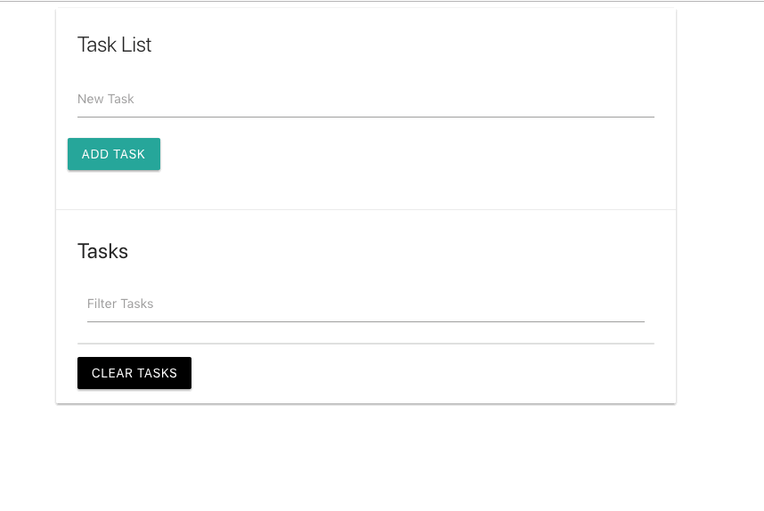

# Task List site, saving to Local Storage

A task list website that saved the tasks to local storage. You can add tasks, filter tasks by writing, delete one task at a time and clear all tasks.

CDNs are used for Materialize CSS (including jQery), Fontawesome.

No jQuery is used, only regular Vanilla JavaScript.

## A screenshot

On desktop

## Author
* Albert Stjärne (https://github.com/AlbertStjarne)